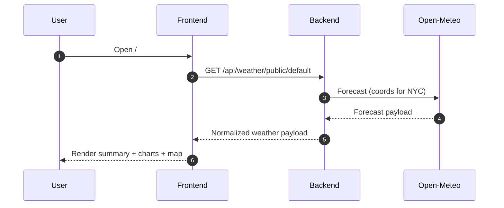
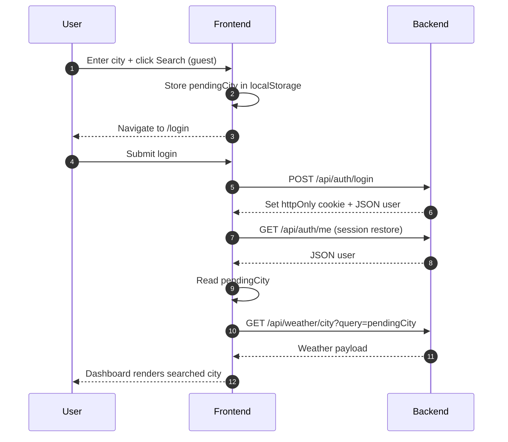
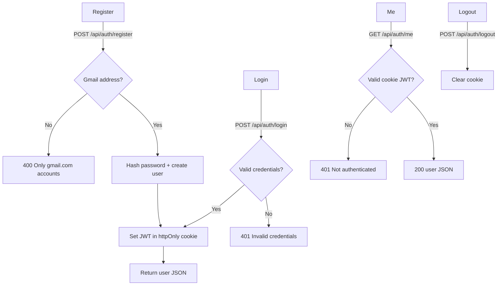
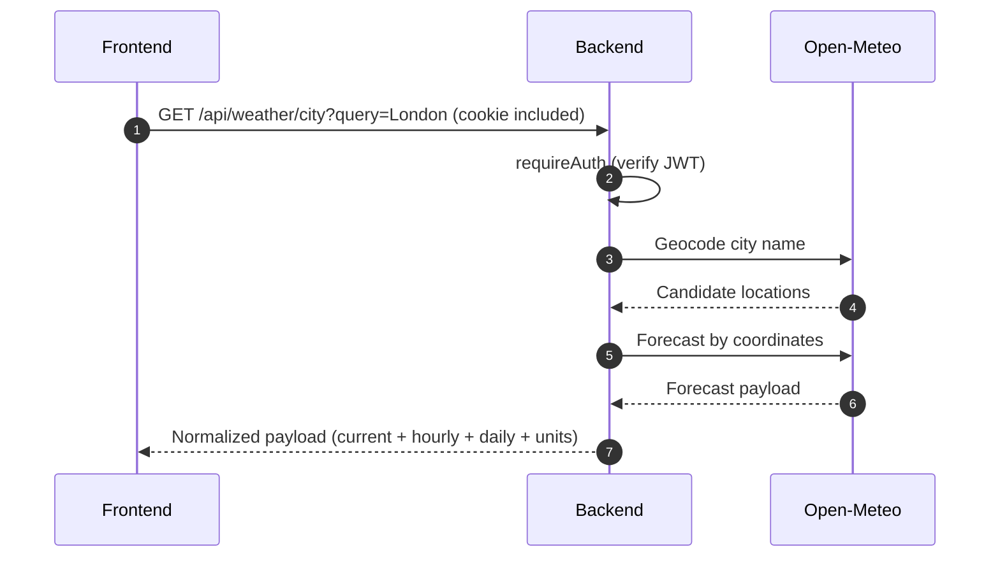
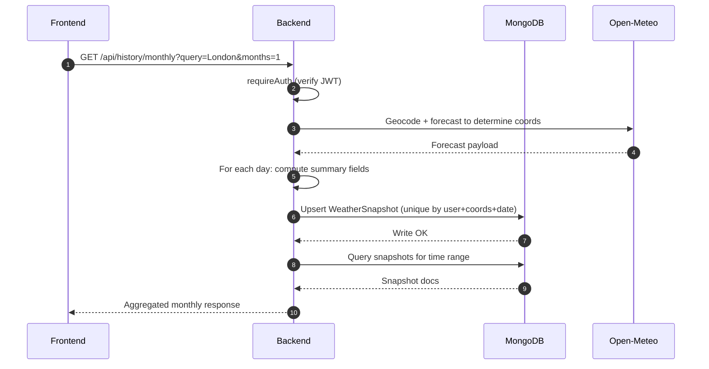

# Flows and Diagrams (How the app works)

This document provides end-to-end diagrams for the major flows in the MERN Weather Application.

> Tip: Mermaid diagrams render nicely in VS Code Markdown Preview (and many PDF exporters).

---

## 1) System architecture (overview)

```mermaid
flowchart LR
  U[User (Browser)] -->|React UI| FE[Frontend (Vite + React)]
  FE -->|Axios + Cookies| BE[Backend (Express API)]
  BE -->|Mongoose| DB[(MongoDB)]
  BE -->|HTTP| OM[Open‑Meteo APIs]

  subgraph Open‑Meteo
    OM --> GEO[Geocoding API]
    OM --> FC[Forecast API]
  end
```

---

## 2) Guest dashboard flow (NYC default)



---

## 3) Search redirect flow (guest → login → return)



---

## 4) Auth flow (register / login / logout / me)



---

## 5) City forecast flow (authenticated)



---

## 6) Region flow (nearby cities in same country)

The backend:

- Finds the “base” city from the user query
- Uses a large city dataset (`all-the-cities`)
- Picks nearby cities by radius (fallback radius if needed)
- Fetches current weather for those cities with a concurrency limit

```mermaid
flowchart TD
  Q[Query city name] --> B[Base forecast lookup]
  B --> C[Base location: lat/lon + country code]
  C --> R[Select candidate cities within radius]
  R --> P[Sort by population + de-duplicate]
  P --> F[Fetch current weather for each city (concurrency limited)]
  F --> OUT[Return list + map markers]
```

---

## 7) Country flow (top cities by population)

```mermaid
flowchart TD
  Q[Query city name] --> B[Base forecast lookup]
  B --> CC[Extract country code]
  CC --> TOP[Pick top N cities in that country (population)]
  TOP --> F[Fetch current weather for each city (concurrency limited)]
  F --> OUT[Return list + map markers]
```

---

## 8) Monthly flow (daily snapshots → aggregation)

Monthly is built on a snapshot strategy:

- One snapshot per day per user + coordinates + date
- Upsert prevents duplicates
- Monthly endpoint reads the snapshots and aggregates


