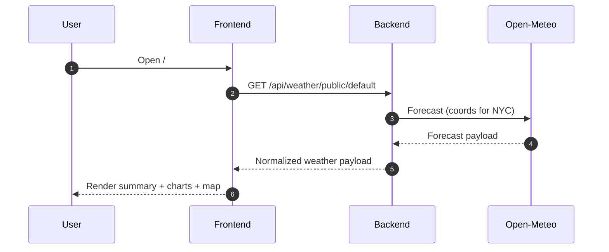
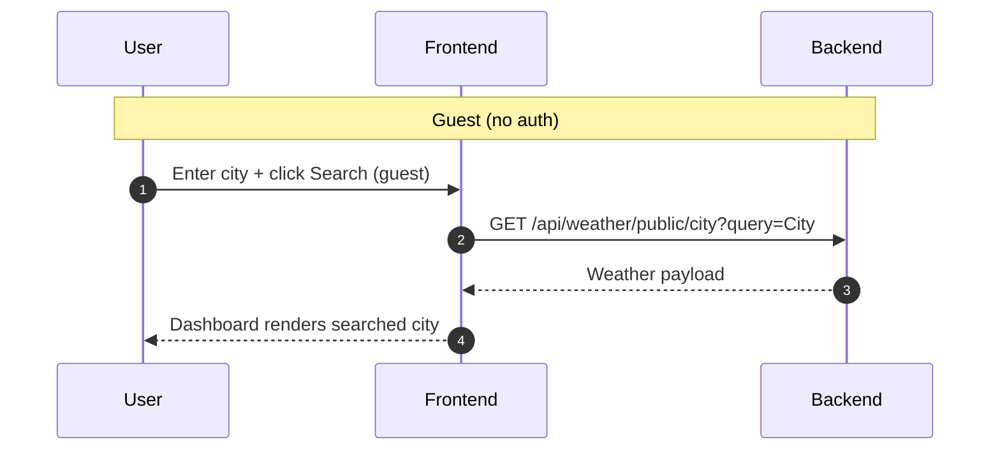
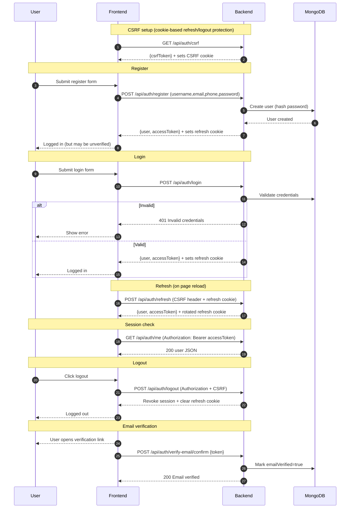
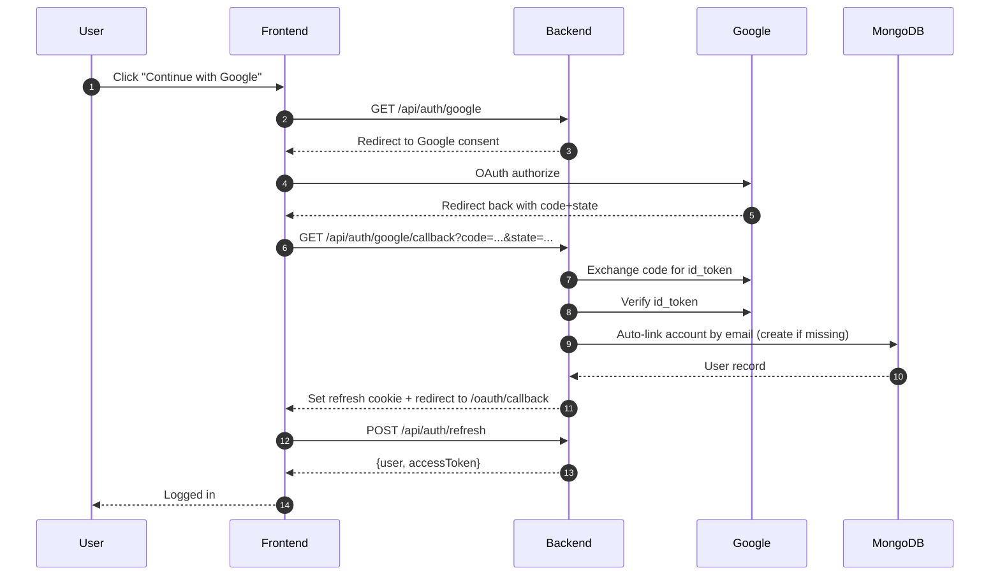
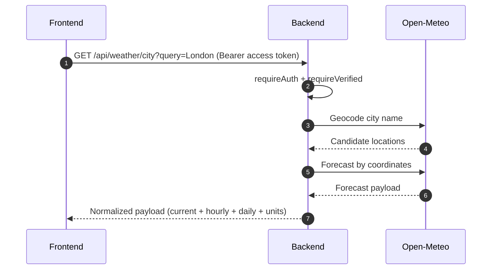
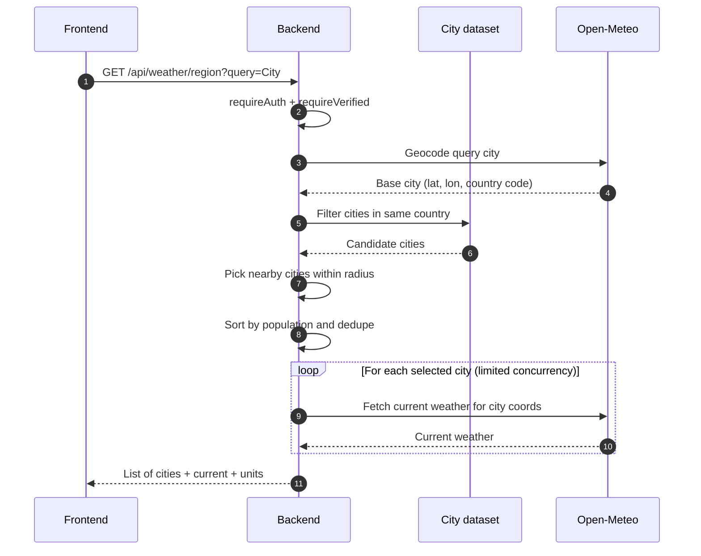
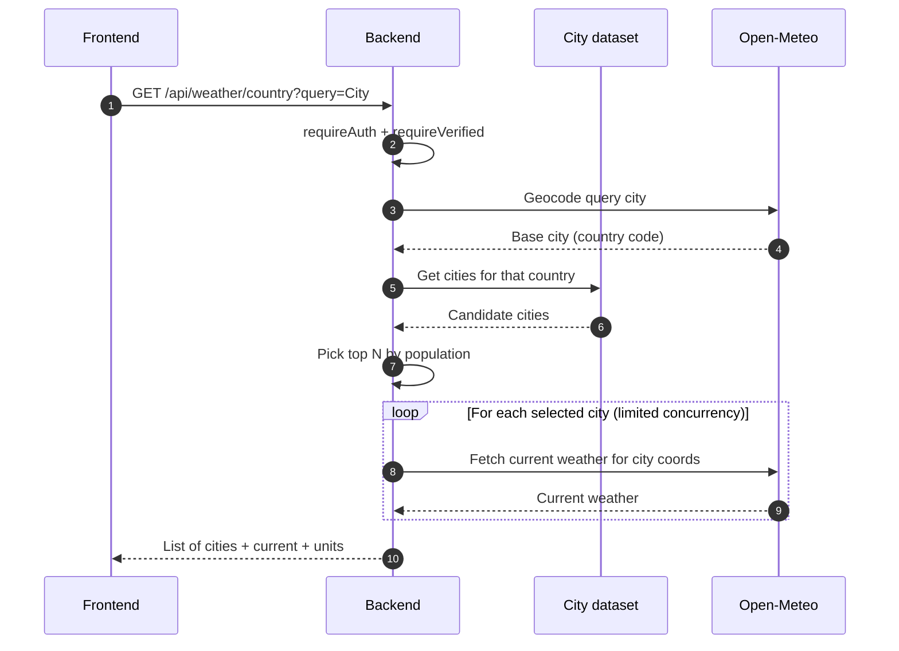
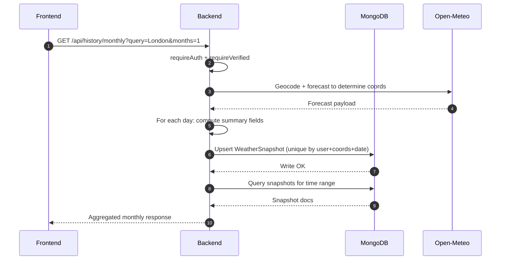

# Flows and Diagrams (How the app works)

This document provides end-to-end diagrams for the major flows in the MERN Weather Application.

> Tip: Mermaid diagrams render nicely in VS Code Markdown Preview (and many PDF exporters).

---

## 1) System architecture (overview)

```mermaid
sequenceDiagram
  autonumber
  participant U as User
  participant FE as Frontend
  participant BE as Backend API
  participant DB as MongoDB
  participant OM as Open-Meteo

  U->>FE: Use the web app
  FE->>BE: Call /api endpoints (Bearer access token; refresh cookie when needed)
  BE->>DB: Read/write users and snapshots
  BE->>OM: Fetch weather data (geocode + forecast)
  OM-->>BE: Weather payload
  DB-->>BE: Data result
  BE-->>FE: Normalized JSON response
  FE-->>U: Render UI (charts + maps)
```

---

## 2) Guest dashboard flow (NYC default)



---

## 3) Guest city search flow



---

## 4) Auth flow (csrf / register / login / refresh / logout / me)



---

## 5) Google OAuth flow



---

## 6) City forecast flow (authenticated)



---

## 7) Region flow (nearby cities in same country)

The backend:

- Finds the “base” city from the user query
- Uses a large city dataset (`all-the-cities`)
- Picks nearby cities by radius (fallback radius if needed)
- Fetches current weather for those cities with a concurrency limit



---

## 8) Country flow (top cities by population)



---

## 9) Monthly flow (daily snapshots → aggregation)

Monthly is built on a snapshot strategy:

- One snapshot per day per user + coordinates + date
- Upsert prevents duplicates
- Monthly endpoint reads the snapshots and aggregates


